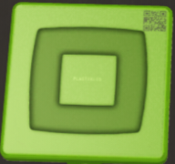
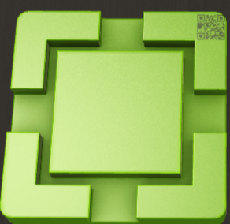
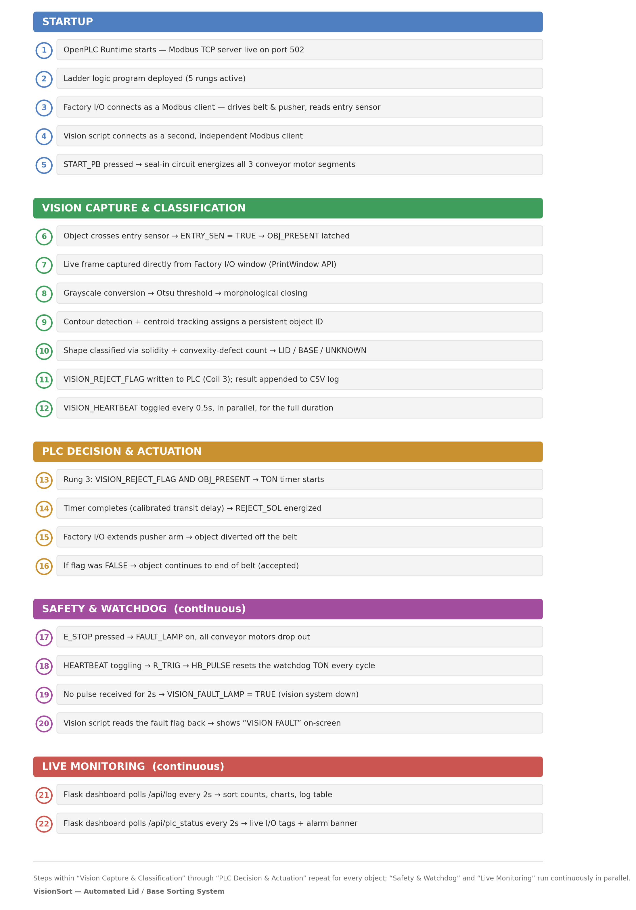

# VisionSort — Automated Lid/Base Sorting System


## Demo:


## Introduction:
VisionSort is a vision-guided industrial sorting system that combines computer vision with PLC-based control logic to automatically classify and sort two part types — **Lid** and **Base** — on a conveyor line. A live camera feed is analyzed in real time using contour detection and silhouette shape analysis, and the classification result is communicated to a soft-PLC (OpenPLC) over Modbus TCP, which drives the physical sorting mechanism (conveyor motor and reject pusher) on a simulated line built in Factory I/O. The system includes a fault-detection watchdog that lets the PLC independently detect if the vision system itself has failed, and SCADA-based analytics dashboard using flask for reviewing sorting history. The project is built end-to-end from scratch — the ladder logic, the vision pipeline, and the Modbus integration between them — rather than relying on any single pre-built tool to do the work.

## Problem Statement:
Traditional conveyor sorting relies on simple photoelectric sensors that can only answer binary presence/absence questions, limiting sorting decisions to basic physical properties like height or position. This makes it difficult to distinguish between visually similar part types or catch defects a single-point sensor cannot detect. Integrating a vision system into a real industrial control line also requires careful architectural discipline: the PLC must retain full authority over real-time control, timing, and safety, while the vision system acts only as an advisory input — and the control system needs a way to detect if that advisory input itself has failed, rather than silently trusting stale data. VisionSort addresses this by building a complete, correctly-architected pipeline: a vision classifier that feeds a decision into a PLC, which retains sole control over actuation and safety, with a watchdog mechanism that detects vision-system failure independently of the sorting logic itself.

## The Parts Being Sorted

| Lid | Base |
|---|---|
|  |  |
| Simple rounded-square outline, nested concentric-ring surface pattern | Four L-shaped corner brackets with concave notches cut into the outline (a cross/bracket silhouette) |

Both parts share the same color family and both have some rotational symmetry in their surface pattern — a combination that ruled out the two most obvious classification approaches.

## System Pipeline


### 1. Image Capture
The system captures live frames directly from the Factory I/O simulation window using the Windows `PrintWindow` API (via `pywin32`), rather than a physical camera or a virtual-camera bridge like OBS. This captures the window's rendered content directly from its own buffer, which avoids a real problem encountered early on: screen-region capture (via `mss`) grabbed raw screen pixels rather than window content, so when the output window overlapped the Factory I/O window on screen, the pipeline captured *itself*, producing a recursive video-feedback effect. `PrintWindow` reads the target window's content regardless of what else is on screen or on top of it.

### 2. Object Detection (Contour-Based, not YOLO)
Each frame is cropped to a configurable region of interest (excluding background scenery and UI chrome), converted to grayscale, and processed with **Otsu adaptive thresholding** to separate objects from the belt background regardless of lighting. Contour detection then locates every object currently in frame.

A pretrained YOLOv8 model was tested first and **discarded** for detection — it is trained on COCO's ~80 everyday object classes and produced zero detections on these synthetic, non-standard parts regardless of confidence threshold. Since the actual requirement was "find any object-shaped blob on the belt," not semantic recognition, direct contour detection is the correct and more reliable tool here.

**Morphological closing** (`cv2.MORPH_CLOSE`) is applied to the thresholded image before contour extraction. This was a necessary fix for a real fragmentation issue: the Base part's own concave notches and shading could cause it to threshold into several disconnected blobs (e.g., its four corner brackets detected as separate objects), which independently generated multiple tracker IDs and conflicting classifications for what was a single physical object. Closing bridges small gaps to unify an object's fragments into one contour, while a design constraint (see below) ensures it doesn't erase the genuine large-scale notches the shape classifier depends on.

### 3. Object Tracking
A centroid-based tracker assigns a persistent ID to each detected object and follows it across frames. It includes a **grace period** (`MAX_MISSED_FRAMES`): if an object isn't detected for a few consecutive frames (a brief flicker from motion blur or lighting), the tracker holds its last known position rather than immediately freeing the ID. Without this, a single missed frame would cause the same physical object to be re-assigned a new ID on reappearance — triggering a duplicate classification and a duplicate PLC signal for one real object.

### 4. Shape Classification — Lid vs Base
Each tracked object is classified using **contour shape analysis**, not color or texture matching:
- **Solidity** = contour area ÷ convex hull area. Lid's simple rounded-square outline is close to fully convex (solidity near 1.0). Base's concave bracket notches pull this noticeably lower.
- **Convexity defect count** — the number of significant concave dents in the outline, computed via `cv2.convexityDefects`. Lid has ~0; Base has several, corresponding to its bracket notches.

An object is classified `UNKNOWN` if neither signal clears its threshold — a deliberate fail-safe (see Sorting Decision below).

### 5. Sorting Decision
A configurable `DIVERT_CLASS` setting determines which classification triggers a reject. Any object classified as `UNKNOWN` is also diverted by default, rather than being allowed to pass through unclassified — sorting systems should fail toward caution, not silently wave through anything they don't recognize.

### 6. PLC Communication (Modbus TCP)
The classification result is written to OpenPLC Runtime as a Modbus coil (`VISION_REJECT_FLAG`), alongside a **heartbeat** coil toggled every 0.5 seconds. OpenPLC's ladder logic reads these over the same Modbus TCP server that also drives the Factory I/O simulation — both the vision script and the 3D scene are independent Modbus clients talking to one PLC, which is the single source of truth for the sorting decision.

### 7. Ladder Logic (OpenPLC)

| Rung | Function |
|---|---|
| 1 | Motor start/stop with seal-in — `START_PB` energizes the conveyor motor(s), which then hold themselves on via their own contact in parallel, until `STOP_PB` or `E_STOP` breaks the circuit. Drives all three conveyor segments together via parallel coils. |
| 2 | Object-detect latch — `ENTRY_SEN` sets `OBJ_PRESENT`. |
| 3 | Reject solenoid — `VISION_REJECT_FLAG AND OBJ_PRESENT`, through a `TON` timer calibrated to the physical transit time from the entry sensor to the pusher, drives `REJECT_SOL`. |
| 4 | Fault lamp — tied to a dedicated NO contact on `E_STOP`, independent of normal stop logic. |
| 5 | **Vision watchdog** — `VISION_HEARTBEAT` feeds an `R_TRIG` (rising-edge detector) producing a one-scan pulse (`HB_PULSE`) on every toggle. A `TON` timer runs continuously *except* when reset by that pulse; if the heartbeat ever stops (vision script crashed or froze), the timer completes uninterrupted and trips `VISION_FAULT_LAMP` — entirely independent of the sorting logic. |

**I/O Tag Table**

| Tag | Address | Modbus Point | Direction |
|---|---|---|---|
| START_PB / STOP_PB / E_STOP | %IX0.0 / %IX0.1 / %IX0.2 | Discrete Input 0/1/2 | Manual (debugger) |
| ENTRY_SEN | %IX0.3 | Discrete Input 3 | Factory I/O -> PLC |
| CONV_MOTOR / _2 / _3 | %QX0.0 / %QX0.6 / %QX0.7 | Coil 0/6/7 | PLC -> Factory I/O |
| REJECT_SOL | %QX0.1 | Coil 1 | PLC -> Factory I/O |
| FAULT_LAMP | %QX0.2 | — | Internal |
| VISION_REJECT_FLAG | %QX0.3 | Coil 3 | Python -> PLC |
| VISION_HEARTBEAT | %QX0.4 | Coil 4 | Python -> PLC |
| VISION_FAULT_LAMP | %QX0.5 | Coil 5 | PLC -> Python (read back) |

### 8. Physical Simulation (Factory I/O)
The PLC's coil outputs drive a multi-segment conveyor belt, and its discrete input reads a photoelectric entry sensor — both wired over the same Modbus TCP server as the vision script, so the simulated line reacts to real classification decisions in real time, including the pusher physically diverting rejected objects off the belt.

### 9. Analytics Dashboard
Every classification event is logged to CSV (timestamp, object ID, classification, sort outcome) and reviewed in a standalone HTML dashboard: sort counts, pass/reject/unknown breakdown, a Lid/Base distribution chart, an animated conveyor replay of the actual sorted sequence, and a searchable log table.


## Known Limitations

- **Single-object spacing assumption.** The current object-presence latch (`ENTRY_SEN` -> `OBJ_PRESENT`) does not track multiple simultaneous objects independently — the design assumes objects are spaced far enough apart (via emitter interval) that only one is ever in the "active" zone between the entry sensor and the pusher at a time. A production system would use a shift-register pattern to track each object's classification independently as it moves down the line; this is a deliberate scope decision, not an oversight, and is the first thing to extend for multi-object throughput.
- **Camera-view tradeoff.** Vision classification requires a top-down capture angle for reliable shape analysis, which is not the most visually informative angle for a demo recording. Side-view footage and top-down classification footage are recorded as separate, clearly distinct segments rather than staged as one continuous shot.

## Installation

* Clone this repository and check the ```requirements.txt```:
    ```shell
    git clone https://github.com/Dhruv-patel-17/VisionSort
    cd VisionSort
    pip install -r requirements.txt
    ```
* Set up [OpenPLC Runtime](https://autonomylogic.com), enable its Modbus TCP server (default port 502), and deploy the included ladder logic program.
* Open the provided Factory I/O scene and connect its Modbus TCP/IP driver to the same OpenPLC server, mapping conveyor and pusher outputs to their coil addresses per the I/O table above.
* Simply run:
    ```shell
    python visionsort_contour_pipeline.py
    ```
* To review sorting history, open ```visionsort_analytics.html``` in any browser and load the generated ```classification_log.csv```.

Suggestions for improvement are whole-heartedly welcome
